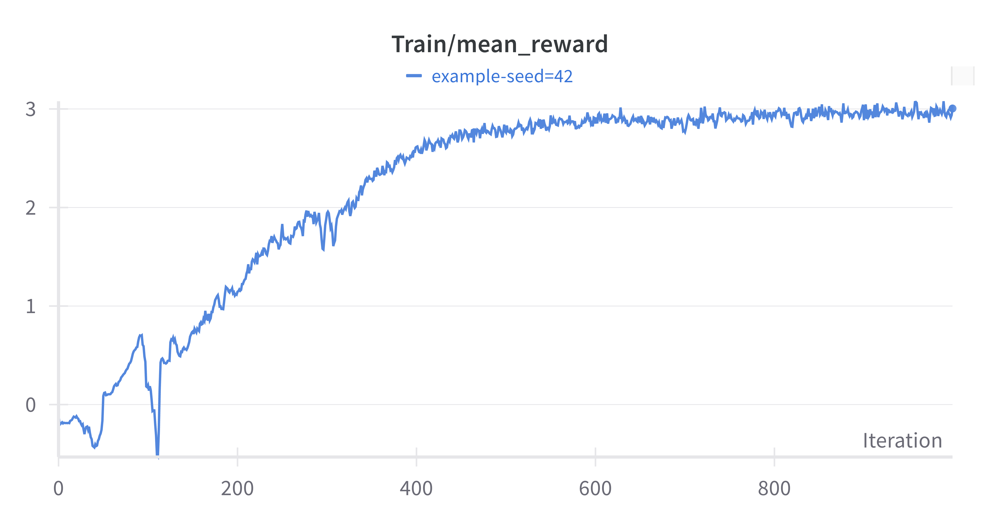
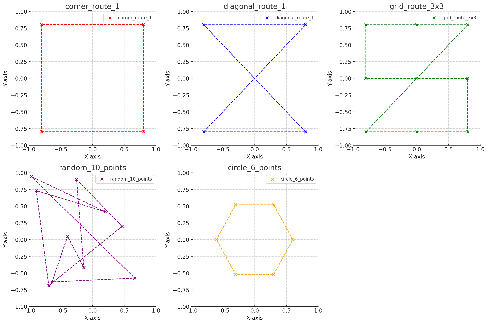
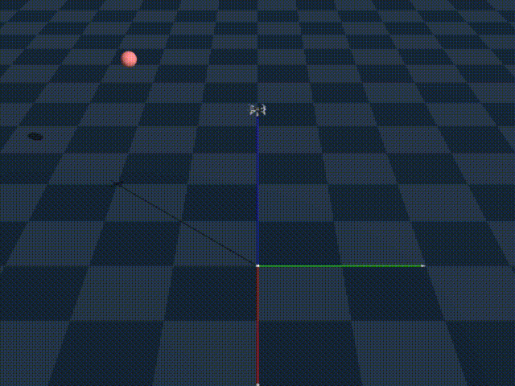
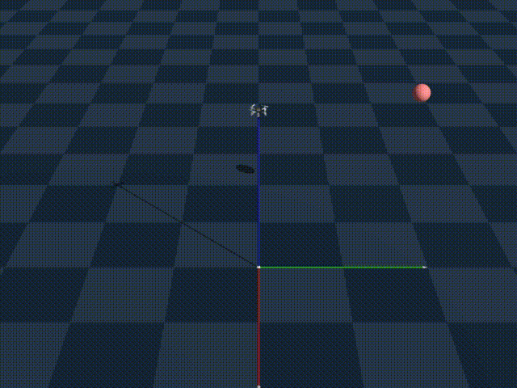
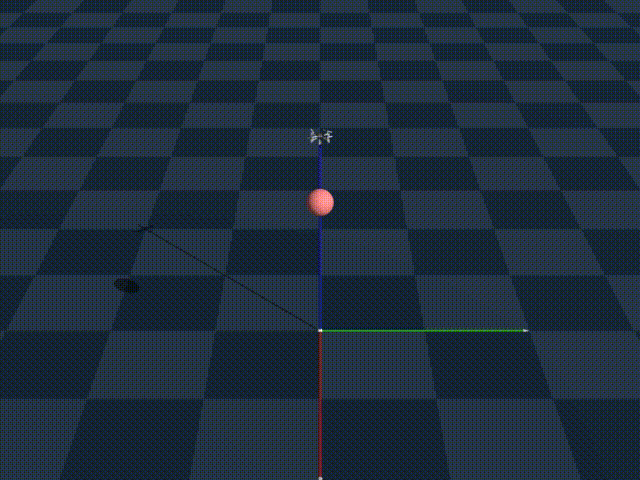

# DroneRL
このレポジトリは [Genesis ドローンホバリングのサンプル](https://github.com/Genesis-Embodied-AI/Genesis/tree/main/examples/drone)を基に作成しました。

## 環境構築
```
conda create --name hover python=3.10 -y
conda activate hover
conda install pytorch torchvision torchaudio -c pytorch

pip install -r requirements.txt
```
参考
- https://note.com/npaka/n/n07b448c74613
- https://note.com/npaka/n/n086f5e017394?sub_rt=share_pw 
## 実行例
### シミュレータ確認
環境構築が完了したら、以下のコマンドでシミュレータが起動することを確認します。
```
python fly.py -v -m
```

### 学習
エージェントの学習は以下のコマンドで実行します。
学習時のハイパーパラメータは、hydraで設定します。
デフォルトの値は、`conf/confg.yaml`を参照してください。
```
python hover_train.py \
    train.experiment_name=example \
    env.num_envs=8192 \
    train.max_iterations=1000 \
    train.policy.actor_hidden_dims=[128,64,32,16,8] \
    train.policy.critic_hidden_dims=[128,64,32,16,8] \
    train.policy.activation=elu \
    train.seed=42
```
以下のような学習曲線を確認できます。


### 評価
学習したエージェントの評価は以下のコマンドで実行します。
```
python hover_eval.py \
    --config-path logs/example/seed=42
```
評価には事前に用意した評価用のデータを活用します。
以下の5種類のデータにおける各点を通るようにしています。

評価結果は、`logs/`以下に作成されます。
結果として確認することができる動画（`video.mp4`）の例を以下に挙げます。

#### corner_route_1


#### diagonal_route_1


#### grid_route_3x3


#### random_10_points


#### circle_6_points
